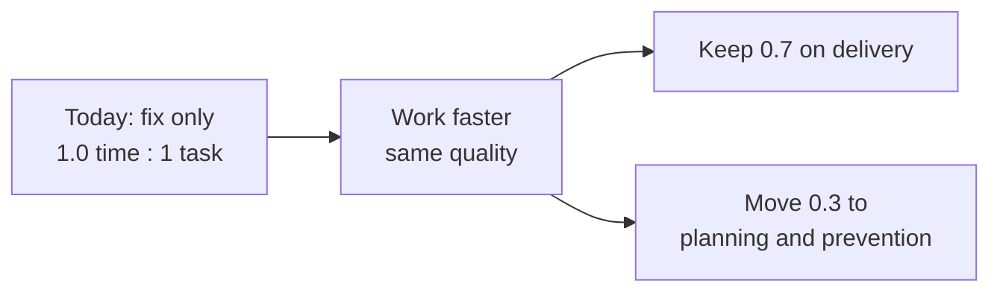

# ROC — year one goals (draft)

Targets below are **planning defaults** for year one; confirm numeric floors and dates with the **General Manager** and **ROC Supervisor**, then adjust after the first baseline quarter. Review quarterly.

**Highest priority:** improve **work / time efficiency**, then spend the time we save on **planning and preventing problems**, not only on fixing them.

## 1. Work / time efficiency and prevention (highest priority)

Absorbed teams — **Information Technology (IT)**, **Support**, **Customer Communications (C-Comm)**, and other departments joining ROC — currently run at about **1.0 : 1** time to task conclusion (one unit of time for each completed task).

The year-one target is a **30%** gain: **0.7 : 1**. That freed **30%** is relocated to **planning and prevention**.

```roc-visual
type: ratio
today: 1.0
target: 0.7
saved: 30%
```

```roc-visual
type: allocation
fix: 70
prevent: 30
```

```roc-visual
type: steps
q1: Baseline | 1.0
q2: First gain | 0.9
q3: Mid-year | 0.8
q4: Year-one target | 0.7
```



- **Metric**: **Time-to-conclusion ratio** for ROC-owned completed work, indexed so today’s absorbed-department baseline is **1.0**. Also track the **share of time** spent on planning / prevention versus break-fix once the baseline exists.
- **Target**: Reach **0.7 : 1** by end of year one, in steps (about **0.9** after the first gain quarter, **0.8** by mid-year, **0.7** at year end). Relocate the recovered **30%** to planning and prevention — do not fill it only with more reactive tickets.
- **How we count**: Use the company-approved ticketing / work system. Baseline in the **first full month** of unified ROC tracking across Information Technology (IT), Support, Customer Communications (C-Comm), and other absorbed queues. Compare average working time per completed item to that baseline. Exclude approved exceptions (for example major incidents) so one crisis does not hide the trend.
- **Owner**: ROC Supervisor
- **Cadence**: Monthly ratio review; quarterly check that saved time is actually used for prevention work (runbook improvements, monitoring hygiene, training, known-error reduction).

## 2. Operational reliability

- **Metric**: Monthly **Service Level Agreement (SLA) attainment** for ROC-owned time-sensitive queues (percentage of items meeting published response and resolution targets once Service Level Agreements are baselined).
- **Target**: Establish baseline in the **first full month** of unified tracking; from the month after baseline, **average ≥ 92%** across the year with **no month below 85%** unless an approved exception is documented.
- **Owner**: ROC Supervisor
- **Cadence**: Monthly review

## 3. Response and escalation consistency

- **Metric**: Percentage of **incidents** (as defined in draft Standard Operating Procedure (SOP) [`SOP-ROC-001`](../procedures/SOP-ROC-001-incident-management-and-escalation.md)) where the **first documented escalation** to Supervisor or Senior occurs **within the published timebox** for that severity class.
- **Target**: **≥ 95%** compliance with published timeboxes for severities that have them; if timeboxes are not yet published, measure “time to first documented escalation” monthly and set a floor by end of the **second quarter (Q2)** of year one.
- **Owner**: ROC Supervisor
- **Cadence**: Monthly review

## 4. Data governance readiness

- **Metric**: (a) Draft Standard Operating Procedure (SOP) [`SOP-ROC-005`](../procedures/SOP-ROC-005-data-export-retention-access-requests.md) (data export, retention, access) published and listed in [procedures README](../procedures/README.md); (b) **quarterly data-handling checklist** completion rate for ROC Agents with data/shore or customer-data touchpoints.
- **Target**: Standard Operating Procedure (SOP) [`SOP-ROC-005`](../procedures/SOP-ROC-005-data-export-retention-access-requests.md) **approved and indexed by end of the second quarter (Q2)** of year one; checklist **100%** completed each quarter for in-scope roles (exceptions only with Supervisor approval).
- **Owner**: ROC Supervisor, with ROC Information Technology (IT) stream support as applicable
- **Cadence**: Quarterly review

## 5. Migration and workforce stabilization

- **Metric**: **Training completion rate** for assigned migration curriculum per wave; **time-to-competency** (signed checklist or equivalent) for core tools in the assigned stream.
- **Target**: **100%** assigned training completed **before** go-live for each wave; competency checklist **signed within 30 calendar days** of role start (or wave cutover), unless Human Resources (HR) documents an extension.
- **Owner**: ROC Supervisor
- **Cadence**: Per migration wave

## 6. Customer experience (unified front door)

- **Metric**: **Internal quality sampling** pass rate for handled cases (rubric owned by Supervisor), or **customer satisfaction** scores if/when a stable survey exists for ROC-touched journeys—pick one primary measure and do not double-count.
- **Target**: **≥ 85%** pass rate on monthly Quality Assurance (QA) sample once sampling starts in the **first quarter (Q1)**; if Customer Satisfaction (CSAT) is adopted, set a comparable floor with the General Manager (GM) by end of the **first quarter (Q1)** and track quarterly.
- **Owner**: ROC Supervisor
- **Cadence**: Quarterly review

## 7. Audit / documentation completeness

- **Metric**: Percentage of **priority Standard Operating Procedures (SOPs)** listed in [procedures README](../procedures/README.md) at **Approved** (or company-equivalent) status plus **Agent acknowledgment** on file for Standard Operating Procedures that require read-and-sign.
- **Target**: Standard Operating Procedure (SOP) `SOP-ROC-001` approved, indexed, and **acknowledged by all in-scope Agents within 60 days** of publish; by end of year one, **at least half** of the indexed priority Standard Operating Procedures (rows in the procedures table) moved out of “planned/template only” into published draft or approved, per Document Control rules.
- **Owner**: ROC Supervisor
- **Cadence**: Quarterly review
