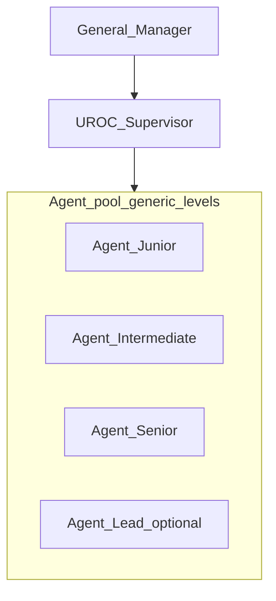

# UROC organization chart

## Narrative

- **General Manager (GM)** owns overall business outcomes and resource allocation for Marine Technologies lines reporting through this structure.
- **UROC Supervisor** is the single operational lead for UROC: priorities, staffing alignment (with GM), escalation ownership, and quality of remote operations and customer touchpoints.
- **Agents** form a deliberately **generic** job family with **levels** (Junior → Senior, optional Lead). Work is organized by **streams** (support, IT touchpoints, monitoring, remote ops support, data/shore pipeline) without multiplying parallel hierarchies prematurely—people grow **up** the ladder before the org grows **wide**.

## Diagram

## Streams (matrix, not separate reporting lines initially)

Map people to streams in HR/job descriptions or a roster—not as extra boxes above unless scale demands it.

| Stream | Examples of ownership |
|--------|------------------------|
| Customer support | Tickets, triage, escalation to engineering/vendors |
| IT (remote services) | Accounts, VPN/remote access logistics, tooling admin |
| Remote monitoring | Watch consoles, alarms, routine checks |
| Remote operations support | Assisted operations per contract/product rules |
| Data / shore pipeline | Ingest health, retention requests, export workflows |

See [roles-and-levels.md](roles-and-levels.md) for level definitions.
