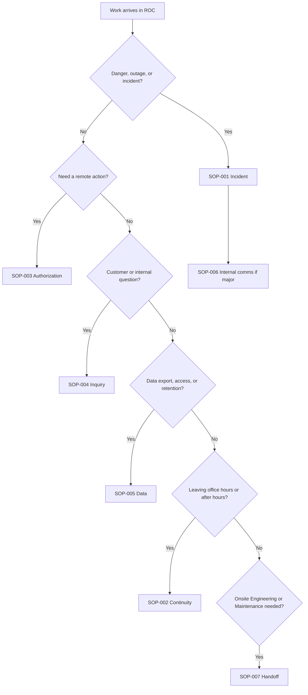

# Standard Operating Procedures (SOPs)

Each procedure keeps the full written steps and also a **flowchart** so Agents can see the path before reading the detail. In the employee portal, boxes that name another procedure are links — click one to open that document in a new tab.

## Which procedure do I use?

## Index

Prioritize authoring these first; link each row when the Standard Operating Procedure (SOP) file exists.

| Identifier (ID) | Title | Status |
|----|-------|--------|
| [SOP-ROC-001](SOP-ROC-001-incident-management-and-escalation.md) | Incident management and escalation | Draft |
| [SOP-ROC-002](SOP-ROC-002-office-hours-handoff-and-on-call-continuity.md) | Office-hours handoff and on-call continuity | Draft |
| [SOP-ROC-003](SOP-ROC-003-remote-intervention-assisted-operations-authorization.md) | Remote intervention / assisted operations authorization | Draft |
| [SOP-ROC-004](SOP-ROC-004-customer-inquiry-routing-and-ownership.md) | Customer inquiry routing and ownership | Draft |
| [SOP-ROC-005](SOP-ROC-005-data-export-retention-access-requests.md) | Data export, retention, and access requests (shore pipeline) | Draft |
| [SOP-ROC-006](SOP-ROC-006-major-incident-communications-internal.md) | Major incident communications (internal) | Draft |
| [SOP-ROC-007](SOP-ROC-007-engineering-and-maintenance-handoff.md) | Engineering and Maintenance handoff (onsite / non-remote work) | Draft |

## Numbering

Use prefix **SOP-ROC-###** for departmental Standard Operating Procedures. If Marine Technologies uses a global numbering scheme, align with Document Control.

## How to add a Standard Operating Procedure

1. Copy [sop-template.md](../../templates/sop-template.md) to `docs/procedures/SOP-ROC-NNN-title.md`.
2. Fill all required fields, including owner, approver, effective date, review cycle, records/evidence, training/acknowledgment, revision history, and a **How it flows** flowchart before the written steps.
3. Map any records created by the procedure in the [ROC records matrix](../quality/records-matrix.md).
4. Obtain **Supervisor** review and follow Marine Technologies Document Control / Quality Management System (QMS) approval before marking Approved.
5. Update the index table above.

## ISO 9001 / Quality Management System alignment

ROC procedures must support Marine Technologies' certified Quality Management System (QMS). Use [ISO 9001 / QMS alignment](../quality/iso-9001-alignment.md) when drafting or revising procedures.

Repository copies are working documents unless Marine Technologies Document Control confirms them as controlled approved documents.
