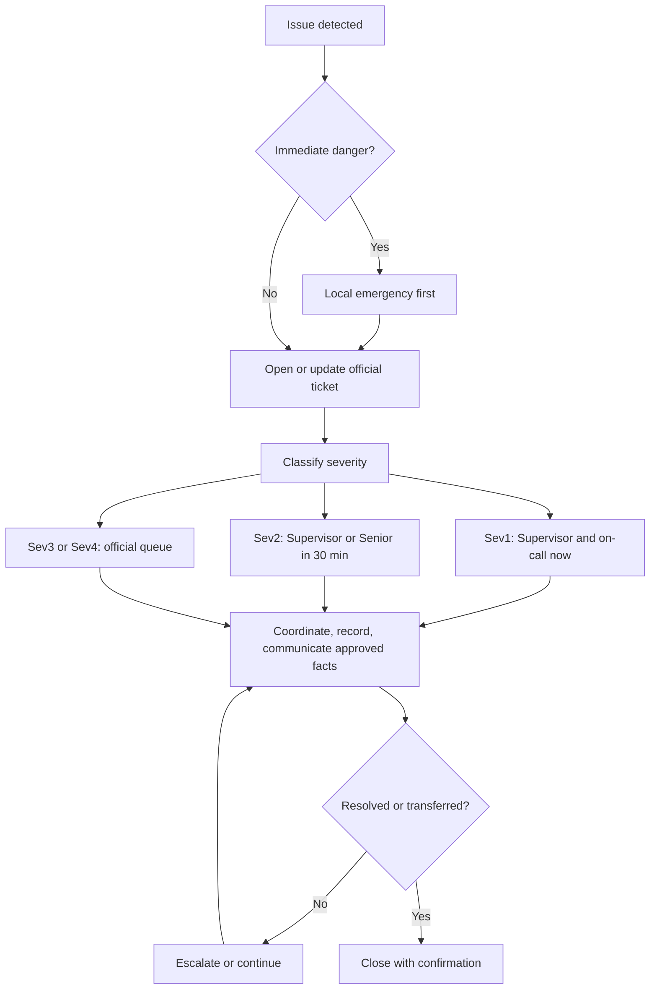

# Standard Operating Procedure (SOP)-ROC-001 — Incident Management and Escalation

| Field | Value |
|-------|-------|
| Version | 0.1 |
| Owner | ROC Supervisor |
| Last reviewed | 2026-05-07 |
| Status | Draft |

## Purpose

Define how ROC receives, triages, documents, escalates, and closes incidents that affect remote operations, customer support, monitoring, data/shore-pipeline continuity, or safety/compliance posture.

This procedure is intended to create a consistent first response and escalation path. It does not replace emergency services, on-vessel command, product engineering authority, Legal/Commercial decision-making, or company-wide incident procedures when those apply.

## Scope

Use this procedure for ROC-owned or ROC-observed incidents, including:

- Safety risk or potential regulatory exposure identified through a ROC channel.
- Customer-impacting outage, degradation, or missed operational handoff.
- Monitoring alarm, remote operations support issue, or abnormal signal requiring action.
- Data/shore-pipeline disruption affecting ingest, retention, access, or export workflows.
- Access, tooling, or remote-service disruption that blocks ROC work.
- Contractual, commercial, or legal ambiguity that affects what ROC can say or do.

Do not record customer names, vessel identifiers, credentials, or detailed incident narratives in this documentation repository. Use official ticket identifiers, Configuration Management Database (CMDB) identifiers, or controlled incident records instead.

## Roles and responsibilities

| Role | Responsibility |
|------|----------------|
| Agent | Detects or receives the issue, protects immediate safety, opens or updates the official ticket, assigns an initial severity, follows documented steps, and escalates ambiguity or high-impact conditions. |
| Senior Agent | Supports triage for complex or cross-stream incidents, validates documentation quality, and coaches Agents through technical steps of the procedure. |
| Agent Specialist | Handles the most complex or novel technical cases in their domain and shares expertise when asked. Does not coordinate other Agents, assign work, or own coverage. |
| ROC Supervisor | Owns escalation decisions, approves procedure deviations within policy, confirms severity changes for high-impact cases, and coordinates with the General Manager or specialist stakeholders. |
| General Manager | Provides business direction for resource, policy, or customer-impact decisions outside the Supervisor’s authority. |
| Product / Engineering | Provides product authority, technical assessment, and safety-critical sign-off where required. |
| ROC Information Technology (IT) stream / platform owner | Supports tooling, access, infrastructure, and remote-service availability issues under ROC Supervisor direction. |
| Commercial / Legal | Owns contractual interpretation, customer commitments, legal guidance, and external statements where required. |

## Severity classes

These severity classes are planning defaults until approved by the ROC Supervisor and General Manager.

| Severity | Criteria | Initial escalation expectation |
|----------|----------|-------------------------------|
| Severity Level 1 (Sev1) | Immediate safety risk, active regulatory exposure, major customer-impacting outage, or any situation where delay could materially increase harm. | Notify the ROC Supervisor immediately and use the published duty / on-call path. If someone is in immediate danger, follow local emergency procedures first. |
| Severity Level 2 (Sev2) | Significant operational disruption, repeated monitoring alarm with customer or fleet impact, blocked remote operations support, or unresolved ambiguity that needs Supervisor/Senior judgment. | Notify the ROC Supervisor or Senior Agent within 30 minutes of classification. Ownership and coverage questions go to the ROC Supervisor. |
| Severity Level 3 (Sev3) | Standard incident or service degradation with limited impact, known workaround, or contained issue requiring follow-up. | Handle through the official queue; escalate if blocked, impact grows, or ownership is unclear. |
| Severity Level 4 (Sev4) | Routine question, minor issue, documentation gap, or low-impact follow-up that does not require urgent response. | Track in the official system and resolve through normal prioritization. |

## How it flows

## Procedure

1. **Protect safety first.** If there is immediate danger, follow local emergency procedures before any ROC workflow. Do not perform remote actions unless authorization is clear under product, class, regulatory, and company policy. If the vessel–shore link is lost, do not keep commanding; the vessel follows its pre-agreed safe behavior with the crew in control.
2. **Open or update the official ticket.** Use the company-approved ticketing system as the source of truth. Include the issue summary, observed impact, current owner, initial severity, and related ticket or Configuration Management Database (CMDB) identifiers.
3. **Classify initial severity.** Use the severity table above. When in doubt between two severities, choose the higher severity and ask the ROC Supervisor or Senior Agent to confirm. If ownership is unclear, ask the ROC Supervisor.
4. **Capture minimum facts.** Record what was observed, when it was observed, who is affected by role or system category, what action has already been taken, and what decision or support is needed next. Avoid sensitive identifiers in uncontrolled notes.
5. **Escalate according to severity.** Use the published duty / on-call path for Severity Level 1 (Sev1) and urgent Severity Level 2 (Sev2) incidents. Escalate immediately if safety, legal, commercial, or product-authorization boundaries are unclear.
6. **Coordinate the response.** Keep ownership explicit in the ticket. Confirm a named responsible person for the vessel (master aboard in assisted mode). If one vessel needs focused attention while others are being monitored, the ROC Supervisor pulls that vessel to a dedicated seat and redistributes the rest. Handoff notes must include current status, next action, owner, timestamp, and open risks.
7. **Communicate carefully.** Share only approved facts. Do not make commitments about service restoration, contract interpretation, or root cause until the accountable stakeholder has approved the message.
8. **Record timeline and actions.** For significant incidents, use the [incident report template](../../templates/incident-report-template.md) or controlled company incident system to capture timeline, actions taken, root cause if known, and follow-ups.
9. **Close with confirmation.** Close the incident only after the owner confirms impact is resolved or transferred, required communications are complete, follow-up tasks are created, and any procedure or training gaps are noted.

## Escalation

Escalate immediately to the ROC Supervisor when:

- Safety, regulatory, legal, commercial, or product-authorization boundaries are unclear.
- Impact is customer-facing, cross-stream, or likely to miss a published Service Level Agreement (SLA).
- The official source of truth conflicts with monitoring data, customer reports, or internal observations.
- The responsible team or owner is unclear.
- The incident is worsening, repeating, or blocked beyond the severity timebox.

Escalate to Product / Engineering for product behavior, safety-critical control, technical diagnosis, or authorization decisions. Route tooling, access, infrastructure, or remote-service availability issues to the ROC Information Technology (IT) stream under the ROC Supervisor. Escalate to Commercial / Legal for contractual interpretation, external commitments, claims, or legally sensitive communications.

When remote resolution is exhausted or not permitted and the next step requires **customer Maintenance attendance**, **Marine Technologies Engineering** (including vessel visit, project, Factory Acceptance Testing (FAT), or commissioning), use [SOP-ROC-007 — Engineering and Maintenance Handoff](SOP-ROC-007-engineering-and-maintenance-handoff.md) for documented ownership transfer.

Company-specific phone numbers, bridges, rosters, ticket priorities, and channels must be maintained in controlled internal systems, not in this repository.

## References

- [Standard Operating Procedures index](README.md)
- [SOP-ROC-006 — Major Incident Communications (Internal)](SOP-ROC-006-major-incident-communications-internal.md)
- [SOP-ROC-007 — Engineering and Maintenance Handoff (Onsite / Non-Remote Work)](SOP-ROC-007-engineering-and-maintenance-handoff.md)
- [Incident report template](../../templates/incident-report-template.md)
- [ROC charter](../strategy/charter.md)
- [Class concept — assisted remote operations](../strategy/class-and-conops.md)
- [Roles and levels](../org/roles-and-levels.md)
- [Migration Frequently Asked Questions](../migration/faq.md)

## Revision history

| Date | Author | Change |
|------|--------|--------|
| 2026-05-07 | Cursor agent draft | Initial draft for Supervisor review. |
| 2026-05-14 | Cursor agent draft | Linked Engineering / Maintenance onsite handoff to SOP-ROC-007. |
| 2026-09-17 | Cursor agent draft | Added flowchart of the incident path. |
| 2026-09-21 | Cursor agent draft | Aligned incident response with official ConOps: link-loss, named vessel responsible person, focused-seat pull. |
