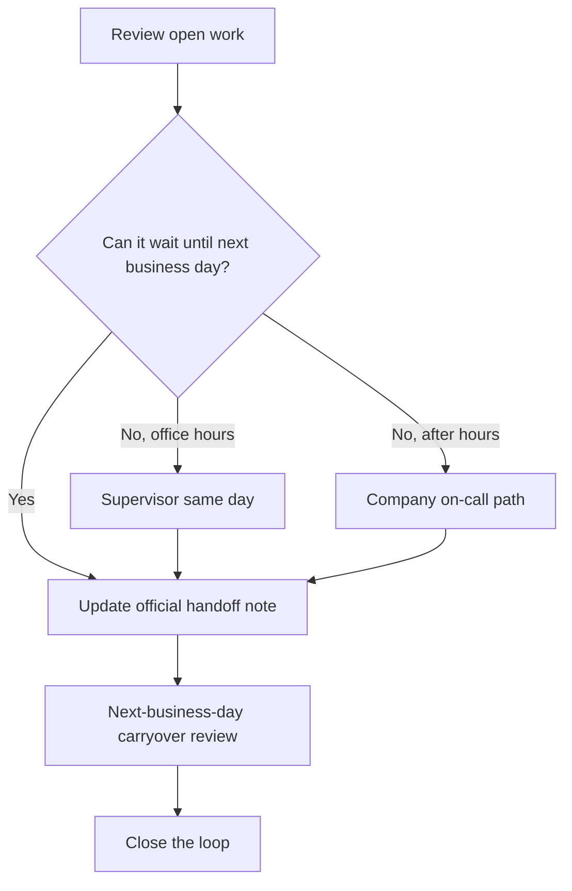

# Standard Operating Procedure (SOP)-ROC-002 — Office-Hours Handoff and On-Call Continuity

| Field | Value |
|-------|-------|
| Version | 0.1 |
| Owner | ROC Supervisor |
| Last reviewed | 2026-05-07 |
| Status | Draft |

## Purpose

Define how ROC maintains continuity for work that carries across normal office hours, planned absences, holidays, weekends, and after-hours periods covered by the company on-call schedule.

ROC does not operate as a shift-based department. This procedure replaces “shift handover” language with office-hours closeout, next-business-day review, and on-call escalation expectations.

## Scope

Use this procedure for:

- End-of-day office-hours closeout for open tickets, monitoring follow-ups, customer inquiries, data/shore-pipeline tasks, and remote operations support items.
- Handoff before planned absence, travel, training, or other time away from office-hours coverage.
- Carryover work that must be visible to another Agent, Senior Agent, Agent Specialist, or the ROC Supervisor.
- After-hours, holiday, and weekend issues that must follow the company on-call schedule.

This procedure does not define the company on-call schedule itself, assign on-call staff, or publish phone numbers, bridges, rosters, ticket priorities, or channel names. Those details belong in controlled internal systems.

Do not record customer names, vessel identifiers, credentials, or detailed incident narratives in this documentation repository. Use official ticket identifiers, Configuration Management Database (CMDB) identifiers, or controlled records instead.

## Roles and responsibilities

| Role | Responsibility |
|------|----------------|
| Agent | Maintains current work records, prepares handoff notes before leaving office-hours coverage, flags blocked or urgent items, and follows the company on-call path when needed. |
| Senior Agent | Reviews carryover risk, supports prioritization of complex items, and confirms that important next technical actions are clear. |
| Agent Specialist | Handles the most complex carryover technical questions in their domain when asked. Does not coordinate coverage, assign next owners, or own other Agents’ handoffs. |
| ROC Supervisor | Owns office-hours continuity expectations, assigns coverage for planned absences, resolves priority conflicts, and confirms when an item must enter the company on-call path. |
| Company on-call owner | Receives after-hours, holiday, and weekend escalations according to the company on-call schedule and owns response within that process. |
| Product / Engineering | Supports product behavior, technical diagnosis, and authorization questions that cannot wait for the next business day. |
| ROC Information Technology (IT) stream / platform owner | Supports tooling, access, infrastructure, and remote-service availability issues that affect continuity under ROC Supervisor direction. |

## Handoff record requirements

Every handoff or carryover note must be recorded in the official system of record, normally the ticketing system. Personal chat messages, personal notes, and uncontrolled spreadsheets are not sufficient.

At minimum, include:

- Current status.
- Current owner and next owner, if ownership changes.
- Next action and expected timing.
- Known blockers, risks, or dependencies.
- Related ticket identifiers, Configuration Management Database (CMDB) identifiers, or controlled record references.
- Whether the item can wait until the next business day or must follow the company on-call schedule.

## How it flows

## Procedure

1. **Review open work before leaving office-hours coverage.** Check assigned tickets, monitoring follow-ups, customer inquiries, data/shore-pipeline items, and remote operations support tasks.
2. **Separate routine carryover from urgent work.** Routine carryover stays in the official queue with a clear next-business-day action. Urgent work follows the escalation rules below and, where applicable, [SOP-ROC-001](SOP-ROC-001-incident-management-and-escalation.md).
3. **Update the official record.** Add the handoff record requirements listed above. If ownership changes, identify the next owner by role or controlled internal assignment, not by adding sensitive details to this repository.
4. **Notify the right role during office hours.** For work that needs same-day attention, notify the ROC Supervisor through the approved internal method so ownership and coverage stay explicit. Escalate technically complex items to a Senior Agent or Agent Specialist.
5. **Prepare planned absence coverage.** Before planned time away, confirm coverage expectations with the ROC Supervisor and update open items with next action, owner, and timing.
6. **Use the company on-call schedule after hours.** After normal office hours, on holidays, or on weekends, route urgent issues through the company on-call schedule. Do not invent alternate informal coverage paths.
7. **Start the next business day with carryover review.** Review open handoffs, confirm ownership, update status, and escalate anything that became urgent or blocked.
8. **Close the loop.** Once the handoff or carryover is resolved, update the official record with outcome, customer/internal communication status, and any follow-up tasks.

## Escalation

Escalate to the ROC Supervisor during office hours when:

- Ownership is unclear.
- Work may miss a Service Level Agreement (SLA), committed response time, or customer expectation.
- A handoff crosses multiple streams and no single owner is obvious.
- A planned absence leaves critical work without coverage.
- The item may require incident handling under [SOP-ROC-001](SOP-ROC-001-incident-management-and-escalation.md).

Route through the company on-call schedule outside office hours, on holidays, or on weekends when:

- There is immediate or potential safety risk.
- There is customer-impacting outage or material service degradation.
- Monitoring or remote operations support indicates abnormal conditions that cannot wait until the next business day.
- Access, tooling, or platform disruption blocks urgent remote-service support.
- Legal, commercial, regulatory, or product-authorization boundaries are unclear and waiting would increase risk.

If there is immediate danger, follow local emergency procedures first, then notify ROC through the appropriate company path.

## References

- [Standard Operating Procedures index](README.md)
- [SOP-ROC-001 — Incident Management and Escalation](SOP-ROC-001-incident-management-and-escalation.md)
- [ROC charter](../strategy/charter.md)
- [Roles and levels](../org/roles-and-levels.md)
- [Training plan outline](../migration/training-plan-outline.md)

## Revision history

| Date | Author | Change |
|------|--------|--------|
| 2026-05-07 | Cursor agent draft | Initial draft for Supervisor review. |
| 2026-09-17 | Cursor agent draft | Added flowchart of office-hours and on-call continuity. |
