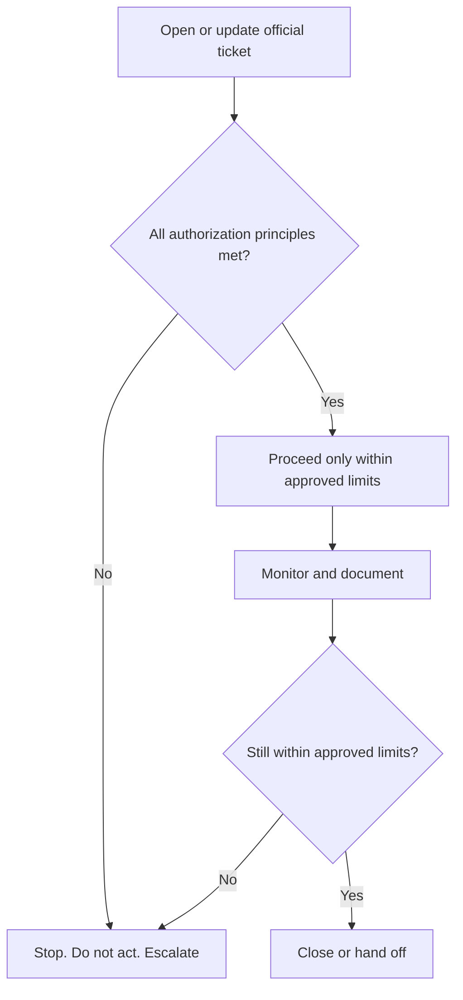

# Standard Operating Procedure (SOP)-ROC-003 — Remote Intervention / Assisted Operations Authorization

| Field | Value |
|-------|-------|
| Version | 0.1 |
| Owner | ROC Supervisor |
| Last reviewed | 2026-05-07 |
| Status | Draft |

## Purpose

Define when ROC may support a remote intervention or assisted operation, what authorization must exist before action, and when ROC must stop and escalate to Product / Engineering, the ROC Supervisor, or other authorized stakeholders.

This procedure protects safety, compliance, product authority, and customer commitments. ROC can coordinate, document, monitor, and support authorized remote work, but ROC does not independently approve safety-critical control changes or replace on-vessel command.

## Scope

Use this procedure for ROC requests or observations involving:

- Assisted remote operations support within contractual and product boundaries.
- Remote diagnostic, configuration, reset, or operational support requests.
- Monitoring alerts where a remote action is requested or appears necessary.
- Customer or internal requests to change operational state, system behavior, access, data flow, or support posture.
- Any situation where authorization boundaries are unclear before a remote action.

This procedure does not authorize emergency response, on-vessel physical work, crewing decisions, product engineering sign-off, legal interpretation, or customer commitments outside approved company channels.

Do not record customer names, vessel identifiers, credentials, or detailed operational narratives in this documentation repository. Use official ticket identifiers, Configuration Management Database (CMDB) identifiers, approved runbooks, or controlled records instead.

## Roles and responsibilities

| Role | Responsibility |
|------|----------------|
| Agent | Receives or observes the request, opens or updates the official ticket, confirms whether authorization is documented, follows approved runbooks, and stops/escalates when boundaries are unclear. |
| Senior Agent | Reviews complex or cross-stream requests, confirms procedure fit, supports Agents with runbook interpretation, and escalates gaps or ambiguity. |
| Agent Specialist | Handles the most complex or novel authorization questions in their domain and shares expertise when asked. Does not coordinate other Agents or authorize the remote action. |
| ROC Supervisor | Owns ROC authorization discipline, approves ROC procedure deviations within policy, resolves priority conflicts, and escalates to the General Manager or specialist stakeholders when authority is outside ROC. |
| Product / Engineering | Owns product behavior, technical authority, safety-critical control decisions, and product/runbook approval. |
| ROC Information Technology (IT) stream / platform owner | Owns access, tooling, infrastructure, and platform changes needed for remote-service support under ROC Supervisor direction. |
| Commercial / Legal | Owns contract interpretation, customer commitments, legal guidance, and externally binding statements. |
| On-vessel / customer-authorized party | Provides vessel-side or customer-side authorization where contract, product rules, or local procedure require it. |

## Authorization principles

Remote intervention or assisted operations support may proceed only when all of the following are true:

1. **Authority is clear.** The request is within ROC scope, and any required Product / Engineering, customer, vessel-side, ROC Information Technology (IT) stream, Commercial, or Legal approval is documented in the official system of record.
2. **The action is defined.** The intended action, expected outcome, rollback or stop condition, and accountable owner are captured in the ticket or approved runbook.
3. **Safety and compliance are protected.** No action conflicts with product safety rules, regulatory obligations, contract boundaries, or on-vessel command.
4. **Access is appropriate.** Personnel use approved accounts, approved tools, and least-privilege access. Credentials must never be shared in tickets, chats, or documentation.
5. **Communication is controlled.** Customer-facing or external commitments are approved by the accountable stakeholder before they are sent.

If any principle cannot be confirmed, do not proceed. Escalate according to this procedure and, if impact is urgent, follow [SOP-ROC-001](SOP-ROC-001-incident-management-and-escalation.md).

## How it flows

## Procedure

1. **Open or update the official ticket.** Record the request, source, current owner, affected system category, intended outcome, and related ticket or Configuration Management Database (CMDB) identifiers.
2. **Classify the request.** Determine whether it is routine support, assisted operations support, potential remote intervention, access/tooling change, incident response, or out-of-scope request.
3. **Check authorization.** Confirm the approved runbook, product rule, contract boundary, or explicit stakeholder approval that permits the action. Link the controlled reference rather than copying sensitive details.
4. **Confirm prerequisites.** Verify required roles are available, access is appropriate, monitoring/rollback expectations are understood, and customer/internal communications are approved where needed.
5. **Proceed only within approved limits.** Agents may execute documented steps within their access and decision rights. Do not improvise product behavior, safety-critical action, or customer commitments.
6. **Monitor and document.** Record start time, action taken, result, next action, owner, and any observed risk in the official system of record.
7. **Stop on uncertainty.** Pause and escalate if the action differs from the approved runbook, impact changes, authorization becomes unclear, signals conflict, or the requester asks for something outside documented limits.
8. **Close or hand off.** Close only when the accountable owner confirms the action is complete or no longer needed, required communications are complete, and follow-up work is recorded. Use [SOP-ROC-002](SOP-ROC-002-office-hours-handoff-and-on-call-continuity.md) for carryover or after-hours continuity.

## Escalation

Escalate to the ROC Supervisor before proceeding when:

- Authorization is missing, informal, conflicting, or unclear.
- The request could affect safety, compliance, operational state, or customer commitments.
- The action crosses multiple streams and ownership is unclear.
- The available runbook does not match the observed situation.
- The request is after hours and cannot wait for the next business day.

Escalate to Product / Engineering when the request involves product behavior, technical diagnosis, safety-critical control, approved operating envelopes, or changes to product/runbook instructions.

Route access, tooling, infrastructure, platform availability, or remote-service enablement issues to the ROC Information Technology (IT) stream under the ROC Supervisor.

Escalate to Commercial / Legal when the request involves contractual interpretation, customer commitments, claims, legal exposure, or externally binding statements.

If there is immediate danger, follow local emergency procedures first. If the issue is an active incident or may materially increase harm, follow [SOP-ROC-001](SOP-ROC-001-incident-management-and-escalation.md).

## Required record

Every remote intervention or assisted operations authorization record must include, at minimum:

- Official ticket identifier.
- Request type and affected system category.
- Accountable owner.
- Authorization source or controlled reference.
- Intended action and expected result.
- Stop condition, rollback expectation, or next safe state if applicable.
- Time action started and ended.
- Outcome, follow-up tasks, and communication status.

## References

- [Standard Operating Procedures index](README.md)
- [SOP-ROC-001 — Incident Management and Escalation](SOP-ROC-001-incident-management-and-escalation.md)
- [SOP-ROC-002 — Office-Hours Handoff and On-Call Continuity](SOP-ROC-002-office-hours-handoff-and-on-call-continuity.md)
- [SOP-ROC-007 — Engineering and Maintenance Handoff (Onsite / Non-Remote Work)](SOP-ROC-007-engineering-and-maintenance-handoff.md)
- [ROC charter](../strategy/charter.md)
- [Roles and levels](../org/roles-and-levels.md)
- [Training plan outline](../migration/training-plan-outline.md)

## Revision history

| Date | Author | Change |
|------|--------|--------|
| 2026-05-07 | Cursor agent draft | Initial draft for Supervisor review. |
| 2026-05-14 | Cursor agent draft | Linked onsite / Engineering handoff reference to SOP-ROC-007. |
| 2026-09-17 | Cursor agent draft | Added flowchart of the authorization gate. |
