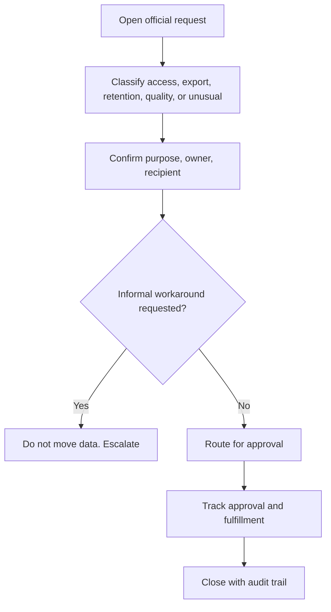

# Standard Operating Procedure (SOP)-ROC-005 — Data Export, Retention, and Access Requests

| Field | Value |
|-------|-------|
| Version | 0.1 |
| Owner | ROC Supervisor |
| Last reviewed | 2026-05-07 |
| Status | Draft |

## Purpose

Define how ROC receives, routes, documents, and tracks requests involving data export, data retention, and access to shore-side operational data.

This procedure supports data discipline, auditability, and minimum necessary access. ROC coordinates and documents requests through its streams, including the Information Technology (IT) stream. Approval authority remains with the ROC Supervisor unless a data owner, Commercial, Legal, General Manager, or other controlled company process is explicitly accountable.

## Scope

Use this procedure for ROC-observed or ROC-received requests involving:

- Export of operational data from approved systems.
- Retention, deletion, preservation, or hold questions.
- Access requests for shore-side operational data, monitoring records, or data/shore-pipeline tools.
- Requests to move data between systems, reports, customers, vendors, or internal teams.
- Questions about where operational data should be stored or referenced.

This procedure does not grant access, approve legal holds, interpret contracts, define customer entitlements, or authorize ad hoc data handling outside approved company systems.

Do not record customer names, vessel identifiers, credentials, raw exports, or detailed operational narratives in this documentation repository. Use official ticket identifiers, Configuration Management Database (CMDB) identifiers, approved data catalog references, or controlled records instead.

## Roles and responsibilities

| Role | Responsibility |
|------|----------------|
| Agent | Opens or updates the official request record, classifies the request, verifies required facts, avoids uncontrolled data movement, and routes to the accountable owner. |
| Senior Agent | Reviews complex or cross-stream requests, validates documentation quality, and identifies data-handling gaps. |
| Agent Specialist | Handles the most complex or novel data-handling questions in their domain and shares expertise when asked. Does not sequence requests, assign owners, or approve access or export. |
| ROC Supervisor | Owns ROC routing discipline, resolves ownership conflicts, approves ROC procedure deviations within policy, and escalates policy gaps to the General Manager or specialist stakeholders. |
| ROC Information Technology (IT) stream / platform owner | Owns access control, platform permissions, export tooling, secure transfer methods, and technical enforcement under ROC Supervisor direction. |
| Data owner / system owner | Owns data classification, allowed use, retention posture, and approval for release or movement where assigned. |
| Commercial / Legal | Owns contract interpretation, customer entitlement, legal hold, disclosure, claim, and regulatory guidance. |
| Requester | Provides business purpose, recipient, timing, intended use, and any required approval evidence. |

## Request categories

| Category | Examples | Required routing |
|----------|----------|------------------|
| Access request | New user access, permission change, tool access, role adjustment. | ROC Information Technology (IT) stream and data/system owner as applicable. |
| Data export | Report, file, extract, customer-facing package, vendor transfer. | Data/system owner; Commercial / Legal if external, contractual, or sensitive. |
| Retention / deletion | Retention period, deletion request, archive question, preservation concern. | Data/system owner; Commercial / Legal for legal hold, contract, or regulatory questions. |
| Data quality / pipeline issue | Missing data, delayed ingest, inconsistent record, export failure. | Data/shore stream owner and ROC Information Technology (IT) stream; incident handling if urgent. |
| Unclear or unusual request | Sensitive data, new use case, unusual recipient, informal workaround. | ROC Supervisor before action. |

## How it flows

## Procedure

1. **Open or update the official request record.** Use the approved ticketing or request system. Capture requester role, business purpose, requested data or access category, intended recipient, timing, and related ticket or CMDB identifiers.
2. **Classify the request.** Use the categories above to determine whether this is access, export, retention/deletion, data quality, or unclear/unusual.
3. **Check minimum required facts.** Confirm business purpose, accountable owner, data/system category, recipient type, requested timeframe, and whether the request is internal, customer-facing, vendor-facing, or regulatory/legal.
4. **Do not move data informally.** Do not use personal drives, unmanaged spreadsheets, personal accounts, chat uploads, or email attachments unless explicitly approved by company policy and the accountable owner.
5. **Route for approval.** Send the request to the ROC Information Technology (IT) stream, data/system owner, Commercial / Legal, or ROC Supervisor as required. ROC IT stream actions remain under ROC Supervisor governance.
6. **Track approval and fulfillment.** Record approval source, controlled reference, fulfillment owner, method used, and completion status in the official request record.
7. **Escalate blocked or risky requests.** Escalate if ownership is unclear, the request is urgent, data classification is uncertain, or the proposed handling conflicts with policy.
8. **Close with audit trail.** Close only when the request is fulfilled, denied, withdrawn, or transferred to another accountable owner, and the record includes the decision and follow-up tasks.

## Escalation

Escalate to the ROC Supervisor when:

- The request lacks a clear business purpose or accountable owner.
- The requester asks for a workaround outside approved systems.
- The request involves sensitive, customer-facing, external, legal, or regulatory data handling.
- A request could affect Service Level Agreement (SLA) commitments, customer expectations, or audit posture.
- The appropriate data owner, platform owner, or approval path is unclear.

Route access control, tooling, infrastructure, secure transfer, or platform availability issues to the ROC Information Technology (IT) stream under the ROC Supervisor.

Escalate to Commercial / Legal for customer entitlement, contract interpretation, data disclosure, legal hold, regulatory questions, or external commitments.

If the request reveals an active outage, data loss, security concern, or urgent operational impact, follow [SOP-ROC-001](SOP-ROC-001-incident-management-and-escalation.md).

## Required record

Every request record must include, at minimum:

- Official ticket identifier.
- Request category.
- Business purpose.
- Data/system category.
- Requester and accountable owner by role or controlled reference.
- Approval source or denial reason.
- Fulfillment owner and secure method, if approved.
- Completion status and follow-up tasks.

## References

- [Standard Operating Procedures index](README.md)
- [SOP-ROC-001 — Incident Management and Escalation](SOP-ROC-001-incident-management-and-escalation.md)
- [SOP-ROC-002 — Office-Hours Handoff and On-Call Continuity](SOP-ROC-002-office-hours-handoff-and-on-call-continuity.md)
- [ROC charter](../strategy/charter.md)
- [Roles and levels](../org/roles-and-levels.md)
- [Training plan outline](../migration/training-plan-outline.md)
- [Year one goals](../goals/year-one-goals.md)

## Revision history

| Date | Author | Change |
|------|--------|--------|
| 2026-05-07 | Cursor agent draft | Initial draft for Supervisor review. |
| 2026-09-17 | Cursor agent draft | Added flowchart of data request routing. |
