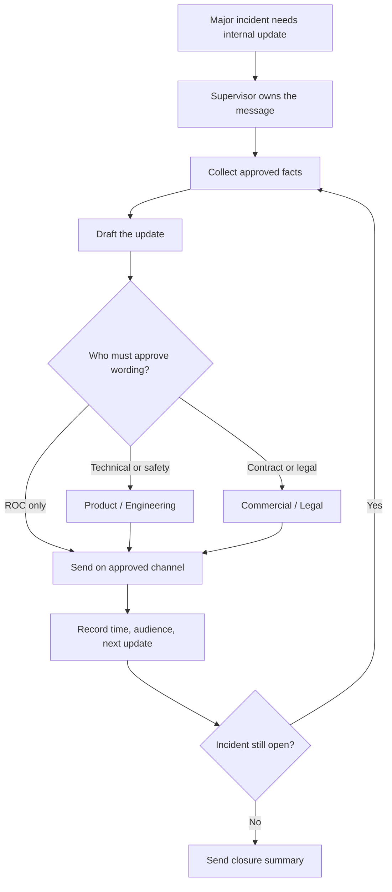

# Standard Operating Procedure (SOP)-ROC-006 — Major Incident Communications (Internal)

| Field | Value |
|-------|-------|
| Version | 0.1 |
| Owner | ROC Supervisor |
| Last reviewed | 2026-05-07 |
| Status | Draft |

## Purpose

Define how ROC prepares, approves, sends, and tracks internal communications during major incidents so stakeholders receive timely, factual updates without creating conflicting messages, unsupported commitments, or uncontrolled disclosure.

This procedure supports [SOP-ROC-001](SOP-ROC-001-incident-management-and-escalation.md). It does not replace incident response, customer communications policy, Legal / Commercial review, or company-wide crisis communications procedures when those apply.

## Scope

Use this procedure when an incident or urgent operational issue requires internal updates beyond the immediate response team, including:

- Severity Level 1 (Sev1) or Severity Level 2 (Sev2) incidents under [SOP-ROC-001](SOP-ROC-001-incident-management-and-escalation.md).
- Customer-impacting outage, material service degradation, or repeated monitoring concern.
- Safety, regulatory, legal, commercial, or product-authorization ambiguity.
- Cross-stream incidents involving ROC streams, Product / Engineering, Commercial, Legal, or General Manager attention.
- Issues likely to generate repeated stakeholder questions before the incident is resolved.

This procedure covers **internal communications only**. External customer, press, partner, regulator, or public communications require the authorized Commercial, Legal, or company communications process.

Do not record customer names, vessel identifiers, credentials, detailed incident narratives, or unapproved root-cause statements in this documentation repository. Use official ticket identifiers, controlled incident records, or approved communications systems instead.

## Roles and responsibilities

| Role | Responsibility |
|------|----------------|
| Agent | Captures facts in the official incident record, routes stakeholder questions to the incident owner, and avoids informal commitments or speculative updates. |
| Senior Agent | Helps consolidate facts and drafts internal updates when the ROC Supervisor delegates that task. |
| Agent Specialist | Contributes domain facts for the most complex cases when asked. Does not coordinate who gathers facts, assign draft work, or approve the message. |
| ROC Supervisor | Owns ROC internal incident communications, approves ROC updates, confirms audience and cadence, and escalates approval needs outside ROC authority. |
| General Manager | Provides business direction for high-impact, cross-functional, or resource-sensitive communications. |
| Product / Engineering | Approves product behavior, technical status, root-cause, safety-critical, and restoration-readiness statements. |
| ROC Information Technology (IT) stream / platform owner | Supports tooling, access, infrastructure, platform status, and restoration statements under ROC Supervisor direction. |
| Commercial / Legal | Approves contractual, customer commitment, claims, legal, regulatory, or externally sensitive wording. |

## Communication principles

Internal major incident communications must be:

1. **Factual.** Share confirmed facts, current impact, owner, next update timing, and known actions. Label unknowns clearly.
2. **Controlled.** Use approved internal channels and audiences. Do not forward uncontrolled screenshots, raw exports, credentials, or sensitive identifiers.
3. **Aligned.** Do not conflict with the official incident record, Product / Engineering guidance, Commercial / Legal guidance, or General Manager direction.
4. **Non-speculative.** Do not guess root cause, restoration timing, customer obligations, or legal/commercial impact.
5. **Time-bound.** Every update should state the next expected update time or closure condition.

## How it flows

## Procedure

1. **Confirm communication trigger.** Determine whether the incident meets scope above or whether the ROC Supervisor has requested internal updates.
2. **Identify the communications owner.** The ROC Supervisor owns ROC internal communications unless they delegate drafting to a Senior Agent or another named role in the official record. Ownership of who contributes facts stays with the ROC Supervisor.
3. **Confirm audience.** Define the internal audience by role or controlled distribution list. Use the smallest audience that still supports response, leadership awareness, and stakeholder alignment.
4. **Collect approved facts.** Pull facts from the official incident record. Confirm severity, current impact, owner, actions underway, known blockers, and next decision point.
5. **Draft the update.** Use the [communications brief template](../../templates/comms-brief-template.md) for structured updates when the incident is complex or recurring.
6. **Check approval boundaries.** Obtain Product / Engineering approval for technical or safety-critical statements, ROC Supervisor approval for platform statements prepared by the ROC Information Technology (IT) stream, and Commercial / Legal approval for contractual, customer commitment, legal, or external-sensitivity statements.
7. **Send through approved internal channel.** Use controlled company channels only. Do not add recipients or channels ad hoc if the information is sensitive.
8. **Record the communication.** Link or summarize the approved internal update in the official incident record, including time sent, audience, approver, and next update time.
9. **Repeat until closed.** Continue updates at the approved cadence until the incident is resolved, transferred, or downgraded. Send a final closure summary when appropriate.

## Update cadence

These cadence defaults are planning guidance until approved by the ROC Supervisor and General Manager:

| Situation | Default internal update cadence |
|-----------|---------------------------------|
| Severity Level 1 (Sev1) active incident | Initial update as soon as practical after triage; then every 30-60 minutes or when material facts change. |
| Severity Level 2 (Sev2) active incident | Initial update after owner/severity confirmation; then every 1-2 hours or when material facts change. |
| Extended investigation with stable impact | At least once per business day, or per Supervisor direction. |
| Resolved incident | Closure summary after impact is resolved, owner confirms status, and follow-up actions are recorded. |

## Escalation

Escalate communication approval to the ROC Supervisor when:

- Audience, wording, or cadence is unclear.
- The incident may affect customer commitments, safety, compliance, legal posture, or business reputation.
- Internal stakeholders are receiving conflicting information.
- A stakeholder requests an external-facing statement or customer commitment.
- Root cause, restoration time, or business impact is uncertain.

Escalate to Commercial / Legal before any wording that could be interpreted as a contractual commitment, claim response, legal position, regulator-facing statement, or external customer communication.

Escalate to Product / Engineering before any wording about product behavior, safety-critical state, technical root cause, or restoration readiness.

## Required record

Every major incident communication record must include, at minimum:

- Official incident ticket identifier.
- Communication owner.
- Internal audience.
- Approved message or controlled link.
- Approver by role.
- Time sent.
- Next update time or closure condition.
- Open questions and follow-up tasks.

## References

- [Standard Operating Procedures index](README.md)
- [SOP-ROC-001 — Incident Management and Escalation](SOP-ROC-001-incident-management-and-escalation.md)
- [SOP-ROC-002 — Office-Hours Handoff and On-Call Continuity](SOP-ROC-002-office-hours-handoff-and-on-call-continuity.md)
- [Communications brief template](../../templates/comms-brief-template.md)
- [Incident report template](../../templates/incident-report-template.md)
- [External publication review checklist](../marketing/review-checklist.md)
- [ROC charter](../strategy/charter.md)
- [Roles and levels](../org/roles-and-levels.md)

## Revision history

| Date | Author | Change |
|------|--------|--------|
| 2026-05-07 | Cursor agent draft | Initial draft for Supervisor review. |
| 2026-09-17 | Cursor agent draft | Added flowchart of internal incident communications. |
