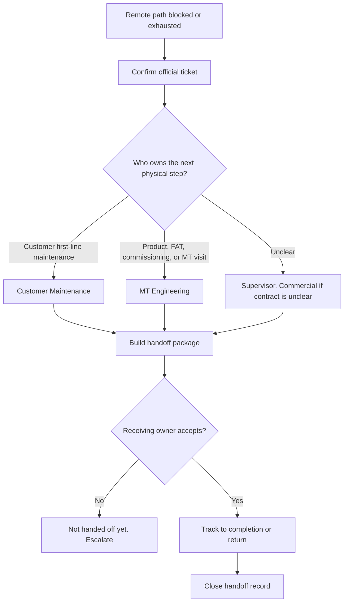

# Standard Operating Procedure (SOP)-ROC-007 — Engineering and Maintenance Handoff (Onsite / Non-Remote Work)

| Field               | Value                                                                                                                                                                                        |
| ------------------- | -------------------------------------------------------------------------------------------------------------------------------------------------------------------------------------------- |
| Document identifier | SOP-ROC-007                                                                                                                                                                                 |
| Version             | 0.1                                                                                                                                                                                          |
| Owner               | ROC Supervisor                                                                                                                                                                              |
| Approver            | ROC Supervisor / Document Control / Quality, as applicable                                                                                                                                  |
| Effective date      | Pending approval                                                                                                                                                                             |
| Last reviewed       | 2026-05-14                                                                                                                                                                                   |
| Review cycle        | Annual or after major process change                                                                                                                                                         |
| Status              | Draft                                                                                                                                                                                        |
| Controlled copy     | Controlled version lives in the approved Marine Technologies Document Control / Quality Management System (QMS) location. Repository copies are drafts unless approved through that process. |

## Purpose

Define the **interface between ROC and Product / Engineering (Marine Technologies Engineering)** and the **rules for handing off work to the customer’s Maintenance organization** when ROC cannot complete resolution remotely.

Marine Technologies Engineering is typically accountable for **projects**, **Factory Acceptance Testing (FAT)**, **system commissioning**, and **vessel visits** when onboard presence is necessary to diagnose or fix a problem. ROC remains the operational front door for remote monitoring and support; this procedure ensures a **controlled, documented transfer of ownership** when physical presence, engineering-led execution, or customer-side maintenance is required.

## Scope

Use this procedure when **all** of the following are true:

- ROC has received or identified a condition through ROC channels (monitoring, remote operations support, customer contact, or internal request).
- Remote diagnosis and permitted remote actions are **exhausted**, **not technically possible**, **not authorized** under contract or product policy, or **unsafe** to continue without onsite verification.
- The next step requires **one or more** of: customer Maintenance attendance, Marine Technologies Engineering attendance (including vessel visit), Engineering-led project work, FAT follow-up, or commissioning activity.

Do **not** use this procedure as a substitute for:

- Active safety emergency response (follow local emergency procedures first).
- [SOP-ROC-001 — Incident Management and Escalation](SOP-ROC-001-incident-management-and-escalation.md) when the case is still in active incident mode—**open or update the incident record first**, then apply this handoff procedure when ownership moves to Engineering or Maintenance.
- [SOP-ROC-003 — Remote Intervention / Assisted Operations Authorization](SOP-ROC-003-remote-intervention-assisted-operations-authorization.md) for remote actions that still remain in scope—obtain authorization there before remote steps, and use this procedure only when moving **off** remote execution.
- Routine inquiry routing without a physical or Engineering execution need ([SOP-ROC-004](SOP-ROC-004-customer-inquiry-routing-and-ownership.md)).

Do not record customer names, vessel identifiers, credentials, or detailed operational narratives in this documentation repository. Use official ticket identifiers, Configuration Management Database (CMDB) identifiers, project identifiers, or controlled records instead.

## Roles and responsibilities

| Role                                                    | Responsibility                                                                                                                                                                                                                                               |
| ------------------------------------------------------- | ------------------------------------------------------------------------------------------------------------------------------------------------------------------------------------------------------------------------------------------------------------ |
| ROC Agent                                              | Completes remote triage within policy, documents facts and evidence pointers, proposes handoff type (customer Maintenance vs Marine Technologies Engineering), updates the official ticket, and requests Supervisor confirmation when the choice is unclear. |
| Senior Agent                                           | Supports complex triage and validates handoff package quality.                                                                                                                                                                                               |
| Agent Specialist                                       | Handles the most complex or novel handoff questions in their domain and shares expertise when asked. Does not assign who prepares the package, track other Agents, or accept ownership on behalf of Engineering or Maintenance.                               |
| ROC Supervisor                                         | Approves handoff recipient when ambiguous, escalates contract or resource conflicts, and ensures a single accountable receiving owner is recorded before ROC closes coordination.                                                                           |
| Product / Engineering (Marine Technologies Engineering) | Accepts or declines ownership for engineering-led work (including projects, FAT, commissioning, and approved vessel technical attendance), provides acceptance criteria and planning inputs, and executes per company engineering and safety processes.      |
| Customer Maintenance department                         | Executes customer-owned physical response, onboard checks, or contractually assigned maintenance actions when the handoff is to the client.                                                                                                                  |
| Commercial / Legal                                      | Provides contractual interpretation when it is unclear whether Marine Technologies or the customer owns the next physical step, travel, or cost.                                                                                                             |
| General Manager                                         | Resolves cross-department resource or priority conflicts outside the ROC Supervisor’s authority.                                                                                                                                                            |

## Definitions

| Term                  | Meaning                                                                                                                                                                                                                                                                                                  |
| --------------------- | -------------------------------------------------------------------------------------------------------------------------------------------------------------------------------------------------------------------------------------------------------------------------------------------------------- |
| **Handoff**           | Documented transfer of **accountable ownership** for the next onsite or Engineering-led action, not informal verbal agreement.                                                                                                                                                                           |
| **Remote exhaustion** | ROC has applied agreed remote triage steps (including authorized remote actions where applicable) and a qualified Agent or Senior Agent concludes that further progress requires onsite presence, Engineering bench or lab work, FAT or commissioning participation, or customer Maintenance execution. |

## Decision criteria: customer Maintenance vs Marine Technologies Engineering

Use the official ticket and contract / service documents as the source of truth. The table below is a **default routing guide** until Marine Technologies Document Control publishes customer-specific overrides.

| Situation                                                                                                                              | Default handoff recipient                                                                                                 |
| -------------------------------------------------------------------------------------------------------------------------------------- | ------------------------------------------------------------------------------------------------------------------------- |
| Contract or service agreement assigns **first-line physical response** or **vessel maintenance** to the customer                       | **Customer Maintenance department** (ROC coordinates ticket and communication; customer owns execution).                 |
| Suspected **product defect**, **design issue**, **software or firmware fix** requiring Engineering change or release                   | **Marine Technologies Engineering**                                                                                       |
| **FAT** defect, test failure, or acceptance criterion dispute tied to Engineering deliverables                                         | **Marine Technologies Engineering**                                                                                       |
| **System commissioning** step, punch-list item, or sea trial support owned by Marine Technologies under contract                       | **Marine Technologies Engineering**                                                                                       |
| Marine Technologies **vessel visit** or onboard attendance is required to complete diagnosis or repair under Marine Technologies scope | **Marine Technologies Engineering** (with Commercial confirmation if visit fees, scope, or customer notice periods apply) |
| Ambiguous scope (“who attends the vessel?”)                                                                                            | **ROC Supervisor** align with **Project Engineer Manager**; record decision criteria in the ticket                       |

## How it flows

## Procedure

1. **Confirm the official record.** Open or continue a record in the company-approved ticketing or incident system. If the situation meets incident criteria, follow [SOP-ROC-001](SOP-ROC-001-incident-management-and-escalation.md) in parallel until severity and safety posture are stable.
2. **State the handoff trigger explicitly.** In the ticket, document at minimum: why remote path is blocked or exhausted, whether remote intervention was attempted under [SOP-ROC-003](SOP-ROC-003-remote-intervention-assisted-operations-authorization.md) (if applicable), and what physical or Engineering-led outcome is needed next.
3. **Classify the handoff type** using the decision table above. Attach or reference contract clause identifiers only in **controlled** systems—do not paste restricted commercial text into uncontrolled notes.
4. **Build a handoff package** for the receiving owner. Minimum content:
  - Problem statement and operational impact (no unnecessary sensitive identifiers).
  - Timeline of observations and actions taken (with timestamps in Coordinated Universal Time (UTC) where used).
  - Evidence pointers (log extracts, alarm identifiers, trend snapshots, Configuration Management Database (CMDB) links) stored per data-handling policy.
  - Known configuration state, software or firmware version references if relevant.
  - Safety, regulatory, or port-state considerations known to ROC.
  - Requested response type: Maintenance attendance vs Engineering visit vs project / FAT / commissioning work.
  - **Stop conditions** and rollback expectations if partial work is performed.
5. **Assign the receiving owner in the system of record.** Name a single accountable role (customer Maintenance lead or Marine Technologies Engineering owner). If Engineering uses internal queues (project, commissioning, FAT), link those identifiers when available.
6. **Coordinate acceptance.** The receiving owner acknowledges ownership or declines with a reason. ROC must not treat the item as “handed off” until acceptance is recorded.
7. **Customer communication.** ROC may communicate status and next steps only with **approved** language. If the message commits to visit timing, scope, or cost, Commercial / Legal or the ROC Supervisor must approve the wording.
8. **Track through completion or return.** If Engineering or Maintenance returns the issue to ROC for remote verification, capture closure criteria and update monitoring or knowledge bases as required.
9. **Close the handoff record** when the ticket shows completed onsite work, a formal deferral with new owner, or documented cancellation with approver.

## Escalation

Escalate to the **ROC Supervisor** immediately when:

- Safety, regulatory, or port-state risk is present or suspected.
- Remote and onsite boundaries are disputed.
- The customer or Engineering rejects ownership without an alternative owner.

Escalate to **Commercial / Legal** when the contract does not clearly state whether Marine Technologies Engineering or customer Maintenance must perform the next step, or when visit scope, fees, or liability are in question.

Escalate to the **General Manager** for cross-department resource conflicts (for example, Engineering capacity vs committed customer response).

## Records and evidence

| Record                                   | System of record                                    | Owner                                                  | Retention source                              |
| ---------------------------------------- | --------------------------------------------------- | ------------------------------------------------------ | --------------------------------------------- |
| Engineering / Maintenance handoff ticket | Company-approved ticketing / work management system | ROC Supervisor until acceptance; then receiving owner | Service / operational record retention policy |
| Handoff package content                  | Ticket fields and controlled attachments            | Same as ticket owner                                   | Same as ticket retention                      |
| Engineering acceptance / decline         | Ticketing or Engineering work system                | Marine Technologies Engineering lead as assigned       | Engineering / project record retention policy |

## Training and acknowledgment

- **Affected roles:** ROC Agents, Senior Agents, and Agent Specialists; ROC Supervisor; Marine Technologies Engineering intake or project leads; Commercial where contract routing applies.
- **Training / read-and-acknowledge:** Per Marine Technologies Human Resources (HR) / Quality process once the Standard Operating Procedure is approved.
- **Competence evidence location:** Company learning or Quality system.
- **Retraining triggers:** Material change to ticketing tools, contract templates, or Engineering intake process.

## References

- [Standard Operating Procedures index](README.md)
- [SOP-ROC-001 — Incident Management and Escalation](SOP-ROC-001-incident-management-and-escalation.md)
- [SOP-ROC-002 — Office-Hours Handoff and On-Call Continuity](SOP-ROC-002-office-hours-handoff-and-on-call-continuity.md)
- [SOP-ROC-003 — Remote Intervention / Assisted Operations Authorization](SOP-ROC-003-remote-intervention-assisted-operations-authorization.md)
- [SOP-ROC-004 — Customer Inquiry Routing and Ownership](SOP-ROC-004-customer-inquiry-routing-and-ownership.md)
- [ROC records matrix](../quality/records-matrix.md)
- [ROC charter](../strategy/charter.md)

## Revision history

| Date       | Author             | Change                                                         |
| ---------- | ------------------ | -------------------------------------------------------------- |
| 2026-05-14 | Cursor agent draft | Initial draft for ROC Supervisor and Document Control review. |
| 2026-09-17 | Cursor agent draft | Added flowchart of Engineering / Maintenance handoff. |

