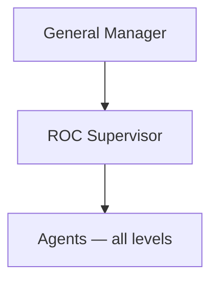

# Welcome to ROC

This is the **employee document library** for Marine Technologies’ **Remote Operations Center (ROC)**. Use it to understand the department, find procedures, and see how work is organized.

Documents here are **internal drafts** until the ROC Supervisor or Marine Technologies Quality / Document Control says otherwise.

## What ROC is

ROC is the shore-side center for remote-facing operations. It brings together customer support, Information Technology (IT) that supports remote services, vessel remote monitoring, remote operations support, and stewardship of data from vessel to shore.

For class and vessel work, the same ROC is the **Remote-Control Station**: a shore watch that **monitors and assists crewed vessels**. The master and minimum crew stay aboard. We do not run uncrewed operations as the default, and we do not take command away from the vessel.

The point is a **coherent Marine Technologies response** for customers, **safe assisted operations** for the fleet, and **clear roles, documented procedures, and measurable quality** for the company.

Read [class concept — assisted remote operations](strategy/class-and-conops.md) before you support a remote action.

## What we do

Streams are **how work is assigned**, not separate reporting lines. All ROC Agents report to the **ROC Supervisor**.

| Stream | Typical work |
|--------|----------------|
| Customer support | Tickets, triage, escalation to engineering or vendors |
| Information Technology (IT) | Accounts, remote access logistics, tooling, platform support |
| Remote monitoring | Consoles, alarms, routine checks |
| Remote operations support | Assisted watch: monitor in transit, lock 1:1 in demanding station-keeping, stay inside contract, product, and class rules |
| Data / shore pipeline | Ingest health, retention requests, export workflows |

## How we are organized

- **General Manager** owns business outcomes and resources.
- **ROC Supervisor** owns day-to-day priorities, coverage, quality, and escalation.
- **Agents** do the work. Levels are **Junior → Intermediate → Senior → Specialist**. Specialist is the highest Agent level and is an individual contributor: it does not coordinate other Agents or own coverage.

See the [organization chart](org/org-chart.md) and [roles and levels](org/roles-and-levels.md).

## How we work

- **Office hours, not shifts.** Leave clear next-business-day ownership. After hours, holidays, and weekends follow the **company on-call schedule**.
- **The official ticketing system is the record.** Do not keep customer or operational decisions only in chat or personal notes.
- **Safety and authorization first.** Do not take remote actions unless product, class, regulatory, and company rules allow it. One controller at a time; onboard override and loss of link send control back to the vessel.
- **Escalate early** when safety, legal, commercial, or ownership is unclear. Coverage and “who owns this?” questions go to the Supervisor.
- **Do not put** customer names, vessel identifiers, credentials, or detailed incident narratives in this library. Use ticket or Configuration Management Database (CMDB) identifiers.

## Where to go next

| If you need… | Open |
|--------------|------|
| Purpose, scope, and principles | [ROC Charter](strategy/charter.md) |
| Class-assisted operating concept | [Class concept](strategy/class-and-conops.md) |
| Who does what on key activities | [Responsibility matrix](strategy/raci.md) |
| Year-one targets | [Year one goals](goals/year-one-goals.md) |
| Your role and level | [Roles and Agent levels](org/roles-and-levels.md) |
| How to handle a case | [Procedure index](procedures/README.md) |
| Joining ROC from another team | [Migration FAQ](migration/faq.md) |

## Using this library

The left menu groups documents by topic. Click **Remote Operations Center** at the top of the sidebar to return here. Ask the ROC Supervisor if a published procedure, roster, or tool instruction differs from a draft on this site.
